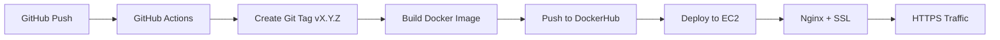

# Backend CI/CD Deployment Guide

Complete guide to deploy the Virtual Focus Room backend on AWS EC2 using Docker, GitHub Actions CI/CD with semantic versioning and SSL/HTTPS.

## Architecture Overview



## Features
- ✅ Automatic semantic versioning (v1.0.0, v1.0.1, ...)
- ✅ GitHub releases with changelog
- ✅ SSL/HTTPS with Let's Encrypt
- ✅ Nginx reverse proxy with WebSocket support
- ✅ Auto-renewal of SSL certificates

---

## Step 1: EC2 Instance Setup

### 1.1 Launch EC2 Instance
1. Go to AWS Console → EC2 → Launch Instance
2. Choose **Ubuntu 22.04 LTS** (t2.micro for free tier)
3. Create/select a key pair (.pem file)
4. Security Group rules:
   - SSH (22) - Your IP
   - HTTP (80) - Anywhere
   - HTTPS (443) - Anywhere

### 1.2 Connect to EC2
```bash
chmod 400 your-key.pem
ssh -i your-key.pem ubuntu@ec2-3-110-173-229.ap-south-1.compute.amazonaws.com
```

### 1.3 Install Docker on EC2
```bash
# Update system
sudo apt update && sudo apt upgrade -y

# Install Docker
sudo apt install -y docker.io docker-compose

# Add user to docker group
sudo usermod -aG docker ubuntu

# Start Docker
sudo systemctl enable docker
sudo systemctl start docker

# Create network for containers
docker network create nginx-network

# Logout and login again
exit
```

---

## Step 2: SSL Setup on EC2

### 2.1 Create Nginx Configuration
```bash
# SSH back into EC2
ssh -i your-key.pem ubuntu@<EC2_IP>

# Create directories
mkdir -p ~/app/nginx ~/app/certbot/conf ~/app/certbot/www

# Create initial nginx config (HTTP only for cert generation)
cat > ~/app/nginx/default.conf << 'EOF'
server {
    listen 80;
    server_name ec2-3-110-173-229.ap-south-1.compute.amazonaws.com;
    
    location /.well-known/acme-challenge/ {
        root /var/www/certbot;
    }
    
    location / {
        proxy_pass http://focus-room-backend:3000;
        proxy_http_version 1.1;
        proxy_set_header Upgrade $http_upgrade;
        proxy_set_header Connection 'upgrade';
        proxy_set_header Host $host;
        proxy_set_header X-Real-IP $remote_addr;
        proxy_set_header X-Forwarded-For $proxy_add_x_forwarded_for;
        proxy_set_header X-Forwarded-Proto $scheme;
        proxy_read_timeout 86400;
    }
}
EOF
```

### 2.2 Start Nginx Container
```bash
# Run nginx
docker run -d \
  --name nginx-proxy \
  --network nginx-network \
  --restart unless-stopped \
  -p 80:80 \
  -p 443:443 \
  -v ~/app/nginx/default.conf:/etc/nginx/conf.d/default.conf:ro \
  -v ~/app/certbot/conf:/etc/letsencrypt:ro \
  -v ~/app/certbot/www:/var/www/certbot:ro \
  nginx:alpine
```

### 2.3 Generate SSL Certificate (if using custom domain)
```bash
# Only if you have a custom domain pointing to EC2
docker run --rm \
  -v ~/app/certbot/conf:/etc/letsencrypt \
  -v ~/app/certbot/www:/var/www/certbot \
  certbot/certbot certonly --webroot \
  -w /var/www/certbot \
  -d yourdomain.com \
  --email your@email.com \
  --agree-tos --non-interactive
```

### 2.4 Update Nginx for HTTPS (after getting cert)
```bash
cat > ~/app/nginx/default.conf << 'EOF'
server {
    listen 80;
    server_name yourdomain.com;
    return 301 https://$server_name$request_uri;
}

server {
    listen 443 ssl http2;
    server_name yourdomain.com;
    
    ssl_certificate /etc/letsencrypt/live/yourdomain.com/fullchain.pem;
    ssl_certificate_key /etc/letsencrypt/live/yourdomain.com/privkey.pem;
    ssl_protocols TLSv1.2 TLSv1.3;
    
    location / {
        proxy_pass http://focus-room-backend:3000;
        proxy_http_version 1.1;
        proxy_set_header Upgrade $http_upgrade;
        proxy_set_header Connection 'upgrade';
        proxy_set_header Host $host;
        proxy_set_header X-Real-IP $remote_addr;
        proxy_set_header X-Forwarded-Proto $scheme;
        proxy_read_timeout 86400;
    }
}
EOF

# Reload nginx
docker exec nginx-proxy nginx -s reload
```

---

## Step 3: GitHub Secrets Setup

Go to your repo → Settings → Secrets and variables → Actions → New repository secret

| Secret Name          | Value                                                |
| -------------------- | ---------------------------------------------------- |
| `DOCKERHUB_USERNAME` | Your DockerHub username                              |
| `DOCKERHUB_TOKEN`    | DockerHub access token                               |
| `EC2_HOST`           | `ec2-3-110-173-229.ap-south-1.compute.amazonaws.com` |
| `EC2_USERNAME`       | `ubuntu`                                             |
| `EC2_SSH_KEY`        | Contents of your .pem file                           |
| `MONGO_URI`          | Your MongoDB connection string                       |
| `JWT_SECRET`         | Your JWT secret                                      |
| `CLOUDINARY_URL`     | Cloudinary URL (if using)                            |
| `ALLOWED_ORIGINS`    | `https://yourdomain.com`                             |

---

## Step 4: Deploy

### 4.1 Push Changes
```bash
git add .
git commit -m "feat: add SSL and versioning support"
git push origin master
```

### 4.2 What Happens on Push
1. ✅ GitHub Actions triggers
2. ✅ Creates new git tag (v1.0.0 → v1.0.1)
3. ✅ Builds Docker image
4. ✅ Pushes to DockerHub with version tag
5. ✅ Deploys to EC2
6. ✅ Creates GitHub Release

### 4.3 Verify Deployment
```bash
# Check HTTPS
curl https://yourdomain.com/health

# Or HTTP (if no custom domain)
curl http://ec2-3-110-173-229.ap-south-1.compute.amazonaws.com/health
```

---

## Step 5: Version Management

### View All Versions
```bash
# GitHub tags
git tag -l

# Docker images on EC2
docker images | grep virtual-focus-room
```

### Rollback to Previous Version
```bash
# SSH to EC2
docker stop focus-room-backend
docker rm focus-room-backend
docker run -d --name focus-room-backend --network nginx-network \
  -e MONGO_URI="..." \
  <image>:v1.0.0
```

---

## Troubleshooting

### Check Container Logs
```bash
docker logs focus-room-backend -f
docker logs nginx-proxy -f
```

### Restart Services
```bash
docker restart focus-room-backend
docker restart nginx-proxy
```

### SSL Certificate Renewal
```bash
docker run --rm \
  -v ~/app/certbot/conf:/etc/letsencrypt \
  -v ~/app/certbot/www:/var/www/certbot \
  certbot/certbot renew

docker exec nginx-proxy nginx -s reload
```
