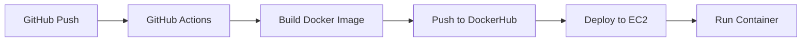

# Backend CI/CD Deployment Guide

Complete guide to deploy the Virtual Focus Room backend on AWS EC2 using Docker and GitHub Actions CI/CD with semantic versioning.

## Architecture Overview



## Prerequisites

- AWS Account with EC2 access
- GitHub repository
- DockerHub account
- Domain name (optional)

---

## Step 1: EC2 Instance Setup

### 1.1 Launch EC2 Instance
1. Go to AWS Console → EC2 → Launch Instance
2. Choose **Ubuntu 22.04 LTS** (t2.micro for free tier)
3. Create/select a key pair (.pem file)
4. Security Group rules:
   - SSH (22) - Your IP
   - HTTP (80) - Anywhere
   - HTTPS (443) - Anywhere
   - Custom TCP (3000) - Anywhere

### 1.2 Connect to EC2
```bash
chmod 400 your-key.pem
ssh -i your-key.pem ubuntu@<EC2_PUBLIC_IP>
```

### 1.3 Install Docker on EC2
```bash
# Update system
sudo apt update && sudo apt upgrade -y

# Install Docker
sudo apt install -y docker.io docker-compose

# Add user to docker group
sudo usermod -aG docker ubuntu

# Start Docker
sudo systemctl enable docker
sudo systemctl start docker

# Logout and login again for group changes
exit
```

---

## Step 2: DockerHub Setup

### 2.1 Create DockerHub Repository
1. Go to [hub.docker.com](https://hub.docker.com)
2. Create account/login
3. Create repository: `<username>/virtual-focus-room-backend`

### 2.2 Create Access Token
1. Account Settings → Security → New Access Token
2. Name: `github-actions`
3. Save the token securely

---

## Step 3: GitHub Secrets Setup

Go to your repo → Settings → Secrets and variables → Actions → New repository secret

Add these secrets:

| Secret Name          | Value                          |
| -------------------- | ------------------------------ |
| `DOCKERHUB_USERNAME` | Your DockerHub username        |
| `DOCKERHUB_TOKEN`    | DockerHub access token         |
| `EC2_HOST`           | EC2 public IP                  |
| `EC2_USERNAME`       | `ubuntu`                       |
| `EC2_SSH_KEY`        | Contents of your .pem file     |
| `MONGO_URI`          | Your MongoDB connection string |
| `JWT_SECRET`         | Your JWT secret                |
| `CLOUDINARY_URL`     | Cloudinary URL (if using)      |

---

## Step 4: Project Files

### 4.1 Dockerfile (backend/Dockerfile)
```dockerfile
FROM node:20-alpine

WORKDIR /app

# Copy package files
COPY package*.json ./

# Install dependencies
RUN npm ci --only=production

# Copy source code
COPY . .

# Expose port
EXPOSE 3000

# Health check
HEALTHCHECK --interval=30s --timeout=3s --start-period=5s --retries=3 \
  CMD wget --no-verbose --tries=1 --spider http://localhost:3000/health || exit 1

# Start app
CMD ["node", "index.js"]
```

### 4.2 Docker Compose (backend/docker-compose.yml)
```yaml
version: '3.8'

services:
  backend:
    image: ${DOCKER_IMAGE:-virtual-focus-room-backend}:${VERSION:-latest}
    container_name: focus-room-backend
    restart: unless-stopped
    ports:
      - "3000:3000"
    environment:
      - NODE_ENV=production
      - PORT=3000
      - MONGO_URI=${MONGO_URI}
      - JWT_SECRET=${JWT_SECRET}
      - CLOUDINARY_URL=${CLOUDINARY_URL}
      - ALLOWED_ORIGINS=${ALLOWED_ORIGINS}
    healthcheck:
      test: ["CMD", "wget", "-q", "--spider", "http://localhost:3000/health"]
      interval: 30s
      timeout: 10s
      retries: 3
```

### 4.3 GitHub Actions Workflow (.github/workflows/deploy.yml)
```yaml
name: Build and Deploy Backend

on:
  push:
    branches: [master, main]
    paths:
      - 'backend/**'
  workflow_dispatch:

env:
  DOCKER_IMAGE: ${{ secrets.DOCKERHUB_USERNAME }}/virtual-focus-room-backend

jobs:
  build-and-deploy:
    runs-on: ubuntu-latest
    
    steps:
      - name: Checkout code
        uses: actions/checkout@v4
        with:
          fetch-depth: 0

      - name: Generate version
        id: version
        run: |
          VERSION=$(date +%Y%m%d)-$(git rev-parse --short HEAD)
          echo "VERSION=$VERSION" >> $GITHUB_OUTPUT
          echo "Version: $VERSION"

      - name: Set up Docker Buildx
        uses: docker/setup-buildx-action@v3

      - name: Login to DockerHub
        uses: docker/login-action@v3
        with:
          username: ${{ secrets.DOCKERHUB_USERNAME }}
          password: ${{ secrets.DOCKERHUB_TOKEN }}

      - name: Build and push Docker image
        uses: docker/build-push-action@v5
        with:
          context: ./backend
          push: true
          tags: |
            ${{ env.DOCKER_IMAGE }}:${{ steps.version.outputs.VERSION }}
            ${{ env.DOCKER_IMAGE }}:latest
          cache-from: type=gha
          cache-to: type=gha,mode=max

      - name: Deploy to EC2
        uses: appleboy/ssh-action@v1.0.3
        with:
          host: ${{ secrets.EC2_HOST }}
          username: ${{ secrets.EC2_USERNAME }}
          key: ${{ secrets.EC2_SSH_KEY }}
          script: |
            # Pull latest image
            docker pull ${{ env.DOCKER_IMAGE }}:${{ steps.version.outputs.VERSION }}
            
            # Stop existing container
            docker stop focus-room-backend || true
            docker rm focus-room-backend || true
            
            # Run new container
            docker run -d \
              --name focus-room-backend \
              --restart unless-stopped \
              -p 3000:3000 \
              -e NODE_ENV=production \
              -e MONGO_URI="${{ secrets.MONGO_URI }}" \
              -e JWT_SECRET="${{ secrets.JWT_SECRET }}" \
              -e CLOUDINARY_URL="${{ secrets.CLOUDINARY_URL }}" \
              -e ALLOWED_ORIGINS="${{ secrets.ALLOWED_ORIGINS }}" \
              ${{ env.DOCKER_IMAGE }}:${{ steps.version.outputs.VERSION }}
            
            # Cleanup old images
            docker image prune -f
            
            echo "Deployed version: ${{ steps.version.outputs.VERSION }}"
```

---

## Step 5: Deploy

### 5.1 Push Changes
```bash
git add .
git commit -m "ci: add docker and github actions deployment"
git push origin master
```

### 5.2 Monitor Deployment
1. Go to GitHub → Actions tab
2. Watch the workflow run
3. Check EC2: `docker ps` to see running container

### 5.3 Verify Deployment
```bash
curl http://<EC2_PUBLIC_IP>:3000/health
```

---

## Version History

Each deployment creates a version tag: `YYYYMMDD-<commit-hash>`

View all versions:
```bash
# On EC2
docker images | grep virtual-focus-room

# Rollback to previous version
docker stop focus-room-backend
docker rm focus-room-backend
docker run -d --name focus-room-backend ... <image>:<old-version>
```

---

## Troubleshooting

### Check Logs
```bash
docker logs focus-room-backend -f
```

### Check Container Status
```bash
docker ps -a
docker inspect focus-room-backend
```

### Manual Deploy
```bash
docker pull <username>/virtual-focus-room-backend:latest
docker stop focus-room-backend && docker rm focus-room-backend
docker run -d --name focus-room-backend -p 3000:3000 <image>:latest
```
